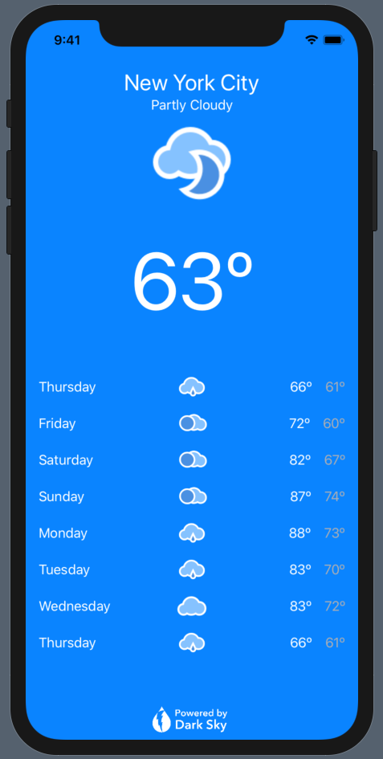

# Weather-SwiftUI

<div style="width: 1000px; height 600px;"></div>


## :clipboard: Overview

Improves upon the original Weather app using SwiftUI. It allows users to call up the current weather and daily forecast for a particular location using the Dark Sky API. It incorporates:

- SwiftUI
- Stacks
- Images and Text
- Gradients
- Parsing JSON using Codable
- Error Handling
- MVVM

## :hammer_and_wrench: Custom Features

Additional features were added to the original functionality of the app, including:

- Custom, dynamic UI using SwiftUI
- Expanded CurrentWeather model including apparent temperature and wind speed
- Included 5-day forecast

## :white_check_mark: Getting Started

> :warning: This app is not available on the App Store.

### Prerequisites

- A valid API key from Dark Sky
- A Mac running macOS Catalina (beta)
- Xcode 11 (beta)

### Installation

1. Clone or download the project to your local machine
2. Open the project in Xcode
3. Replace `YOURAPIKEY` with your valid Dark Sky API key in `DarkSkyAPIClient.swift`

```swift
class DarkSkyAPIClient {
    fileprivate let darkSkyApiKey = "YOURAPIKEY"
```

4. Run the simulator

## :clap: Acknowledgements

The following resources were used in the development of this project. All custom code is my own.

- [Build a Weather App](https://teamtreehouse.com/library/build-a-weather-app-5)
- [SwiftUI Fetching JSON and Image Data with BindableObject](https://www.youtube.com/watch?v=xT4wGOc2jd4)
- Graphics: [Meteocons](https://www.iconfinder.com/iconsets/meteocons) by [Alessio Atzeni](https://www.iconfinder.com/Bluxart)

Interested in learning more about iOS Development? [Sign up today](http://referrals.trhou.se/bobbyconti1)!
